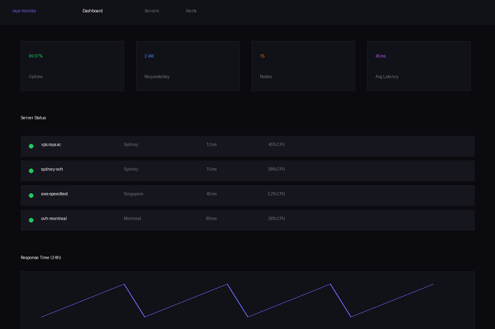

<div align="center">
  
  <!-- Animated Header -->
  

  <!-- Badges -->
  <p>
    <a href="https://raya.li">
      
    </a>
    <a href="https://status.raya.li">
      
    </a>
    <a href="#">
      
    </a>
    <a href="#">
      
    </a>
  </p>

  <p>
    <strong>🔧 Infrastructure • 📊 Monitoring • 🌐 Distributed Systems • 📚 Digital Archives</strong>
  </p>

</div>

---

<!-- About Section with Typing Effect -->
<div align="center">
  
```
┌─────────────────────────────────────────────────────────────────────┐
│                                                                     │
│   Building resilient infrastructure that scales across continents   │
│                                                                     │
│   15+ nodes • 4 regions • Sub-second latency • 2M+ requests/day    │
│                                                                     │
└─────────────────────────────────────────────────────────────────────┘
```

</div>

## 🗺️ Global Infrastructure

<div align="center">

| 🌏 Region | 🏢 Provider | 🔢 Nodes | ⏱️ Latency | 📡 Status |
|:---------:|:-----------:|:--------:|:----------:|:---------:|
| 🇦🇺 Sydney | OVH | 2 | 12ms | 🟢 Operational |
| 🇸🇬 Singapore | AWS | 1 | 45ms | 🟢 Operational |
| 🇨🇦 Montreal | OVH | 1 | 89ms | 🟢 Operational |
| 🇦🇺 Melbourne | Local | 1 | 8ms | 🟢 Operational |

</div>

## 🏗️ Architecture

```
┌─────────────────────────────────────────────────────────────────────────┐
│                           Cloudflare Edge                               │
│                    (DDoS Protection • CDN • WAF)                        │
└───────────────────────────────┬─────────────────────────────────────────┘
                                │
┌───────────────────────────────▼─────────────────────────────────────────┐
│                         Nginx Gateway                                   │
│                 (SSL Termination • Load Balancing)                      │
└───────────────────────────────┬─────────────────────────────────────────┘
                                │
        ┌───────────────────────┼───────────────────────┐
        │                       │                       │
┌───────▼────────┐    ┌────────▼────────┐   ┌────────▼────────┐
│  Monitor Core   │    │   SaaS Admin    │   │  Tool Registry  │
│  Python/WebSocket│   │   Billing/Auth   │   │   90+ Utils     │
└───────┬────────┘    └────────┬────────┘   └────────┬────────┘
        │                      │                      │
        └──────────────────────┼──────────────────────┘
                               │
┌──────────────────────────────▼─────────────────────────────────────────┐
│                    PostgreSQL Cluster                                   │
│              (Primary • Read Replicas • Backups)                       │
└─────────────────────────────────────────────────────────────────────────┘
```

## 🛠️ Tech Stack

<div align="center">

### Backend & Systems
<p>
  
  
  
  
</p>

### Databases & Caching
<p>
  
  
  
  
</p>

### DevOps & Infrastructure
<p>
  
  
  
  
  
</p>

### Frontend
<p>
  
  
  
  
</p>

</div>

## 📦 Projects

<div align="center">

<!-- Project Cards -->

### 🖥️ raya-monitor
<p><em>Real-time infrastructure monitoring with WebSocket live updates</em></p>


```
15+ monitored nodes • Sub-second metrics • Automated alerting


PostgreSQL + WebSocket • Custom dashboards • 99.97% uptime
```

**Stack:** `Python` `Flask` `Socket.io` `PostgreSQL` `Redis`

---

### 🛠️ raya-tools
<p><em>Collection of 90+ utilities for developers and sysadmins</em></p>


```
Network diagnostics • Security tools • Data transformers • Developer utilities
Go + Vue.js • Redis caching • Cloudflare Workers • 10k+ monthly users
```

**Stack:** `Go` `Vue.js` `Redis` `Cloudflare Workers`

---

### 💳 subscription-platform
<p><em>Billing and subscription management with Stripe integration</em></p>


```
Tiered plans • Credit-based usage • API key provisioning • Usage analytics
Real-time balance • Webhook handling • Automated rotation
```

**Stack:** `Python` `PostgreSQL` `Stripe API` `Redis`

---

### 📚 epstein-archive
<p><em>Large-scale document archive with full-text search</em></p>


```
100k+ documents indexed • Full-text search • OCR fallback
Timeline visualization • Entity recognition • PDF export
```

🔗 **Live:** [hmm.raya.li](https://hmm.raya.li)

**Stack:** `Python` `Elasticsearch` `PostgreSQL` `Tesseract OCR`

</div>

## 📊 Performance Metrics

<div align="center">

| Metric | Current | Target | Status |
|:------:|:-------:|:------:|:------:|
| ⚡ API Response (p99) | 45ms | <100ms | 🟢 |
| 🔌 WebSocket Latency | 12ms | <50ms | 🟢 |
| 💾 DB Query (p95) | 8ms | <20ms | 🟢 |
| 📈 System Uptime | 99.97% | 99.9% | 🟢 |
| 🌍 Global Availability | 99.99% | 99.9% | 🟢 |
| 📨 Requests (24h) | 2.4M | - | - |

</div>

## 🔒 Security Posture

<div align="center">

| Layer | Implementation |
|:-----:|:--------------|
| 🌐 Edge | Cloudflare DDoS (L3-7) |
| 🔥 Firewall | UFW + Cloudflare IP whitelist |
| 🔐 Encryption | Let's Encrypt wildcard SSL |
| 🗝️ Auth | API keys + rate limiting |
| 🍪 Sessions | Signed cookies (subdomain) |
| 🔗 Network | Tailscale mesh VPN |
| 🔑 Secrets | Environment-based |

</div>

## 💭 Philosophy

> Ship fast, fix faster. Deploy daily, monitor constantly.
> 
> If it can't be measured, it doesn't exist. Readability > brevity.
> 
> Prefer self-hosted over SaaS. Open by default.

## 🎯 Roadmap

<div align="center">


</div>

### 📅 Short Term (30 Days)
- [ ] Distributed tracing across services
- [ ] Prometheus metrics export
- [ ] Public API documentation site
- [ ] Grafana infrastructure dashboards
- [ ] Automated backup verification

### 📆 Medium Term (3-6 Months)
- [ ] SQLite → PostgreSQL migration
- [ ] Linkerd service mesh
- [ ] Custom status page
- [ ] Anomaly detection for alerts
- [ ] Incident postmortem archive

### 📅 Long Term (6+ Months)
- [ ] Multi-region DB replication
- [ ] Kubernetes migration
- [ ] Custom metrics collector (Go)
- [ ] Infrastructure blog
- [ ] Open-source internal tools

## 📈 GitHub Stats

<div align="center">
  


</div>

---

<div align="center">
  
  <p>
    <a href="https://raya.li">🌐 raya.li</a> • 
    <a href="https://status.raya.li">📊 Status</a> • 
    <a href="https://raya.li/tools">🛠️ Tools</a>
  </p>

  <!-- Footer -->
  

</div>
